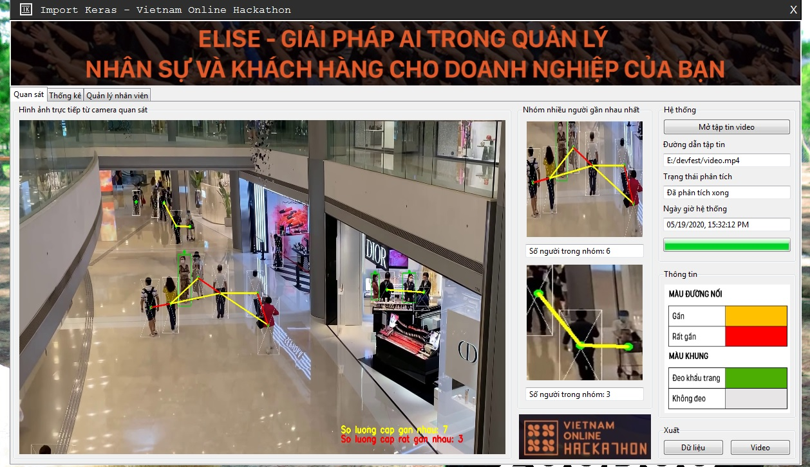
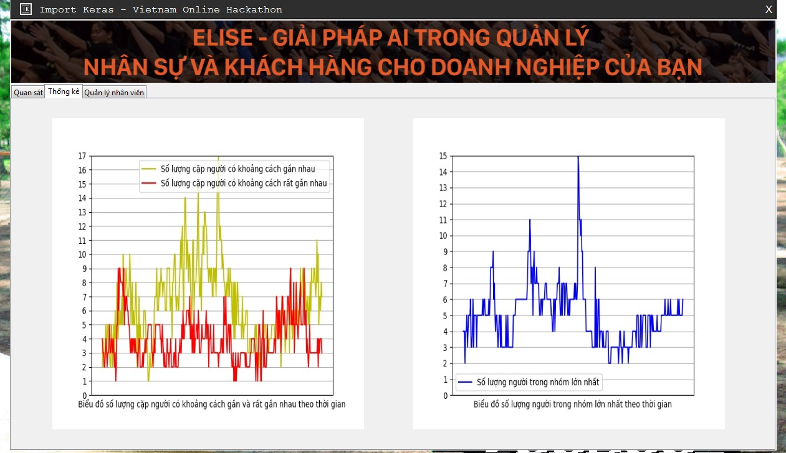
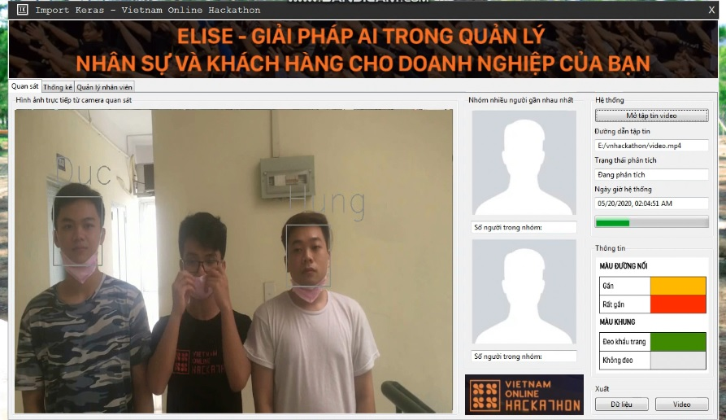

# [ELISE - GIẢI PHÁP AI TRONG QUẢN LÝ NHÂN SỰ VÀ KHÁCH HÀNG CHO DOANH NGHIỆP CỦA BẠN](https://www.youtube.com/)
### Hệ thống cung cấp các tính năng nhận dạng con người, hành vi, khuôn mặt, vật thể thông qua xử lý ảnh giúp thay thế phương pháp truyền thống và cung cấp các gói sản phẩm phục vụ các nhu cầu và hoàn cảnh khác nhau.

Ba tính năng mà chúng tôi chọn để trình diễn trong Hackathon lần này:
- Phần mềm hỗ trợ giám sát thực hiện giãn cách xã hội và đeo khẩu trang
- Xác định người không đeo khẩu trang là ai trong số các nhân viên công ty
- Truy xuất thông tin về lịch sử khách hàng thông qua nhận diện khuôn mặt, có thể tự động nhận dạng khách hàng mới

<p float="left">
  
   
   
</p>

* [Đối tượng sử dụng](#doi-tuong-su-dung)
* [Cần thiết](#can-thiet)
* [Cài đặt](#cai-dat)
  * [Thử nghiệm](#thu-nghiem)
* [References](#references)

## Đối tượng sử dụng

- Các công ty, doanh nghiệp có nhu cầu sử dụng sản phẩm để chấm công chính xác và xác định năng suất lao động
- Các cửa hàng có nhu cầu ghi nhớ về thói quen mua sắm của khách hàng
  
## Cần thiết

* [Python 3.7.6](https://www.python.org/downloads/release/python-376/)
* [Tensorflow 1.15.0](https://www.tensorflow.org/)

## Cài đặt

Đầu tiên tải về Github này
```
git clone https://github.com/importkeras/vnhackathon.git
```

Tiếp theo, gõ dòng lệnh này trong Command Prompt để tự động cài đặt các thư viện cần thiết:
```
pip install -r requirements.txt
```

Cuối cùng tải về [yolo.h5](https://drive.google.com/file/d/1uvXFacPnrSMw6ldWTyLLjGLETlEsUvcE/view) là mô hình nhận dạng người mà chúng tôi đã tinh chỉnh huấn luyện từ yolov3 để đạt độ chính xác rất cao, cho vào thư mục model_data

### Thử nghiệm

Để khởi động chương trình, trỏ Command Prompt tới thư mục chứa tệp tin và gõ vào dòng lệnh sau:
```
python vnhackathon.py
```

## Tài liệu tham khảo

Sản phẩm này được xây dựng để tham gia cuộc thi Vietnam Online Hackathon (vnhackathon.com). 
Những tài liệu tham khảo chúng tôi sử dụng trong sản phẩm này:

* Corona Face Mask Detector ([Github](https://github.com/aribornstein/CoronaFaceMaskDetectionTFJS))
* Tài liệu tham khảo về Yolov3 ([Liên kết](https://medium.com/@manivannan_data/how-to-train-yolov3-to-detect-custom-objects-ccbcafeb13d2))
* Google Cloud Platform ([Liên kết](https://cloud.google.com/))
